# Intro
Hi, I'm a web developer, self-taught MERN stack enthusiast with 2 years of experience as a Laravel Developer. 

Here is my MERN progress repository featuring different projects built from scratch. You can download the repository to check out my work progress and share your feedback.

# Requirements
- Node.js 
- MongoDB 

And you are ready to go!


# Installation
You can download the ZIP file or clone the repository using:

```bash
git clone https://github.com/Yash-Jangir/my-mern-progress.git
```

# Environment Setup
For both frontend and backend:

1. Create a `.env` file and copy the configurations from `.env.sample` correspondingly.
2. Replace configurations to fit your needs.

Install dependencies for both frontend and backend by running:

```bash
npm install
```

### Start the Backend
To start the backend, run:

```bash
npm run start
```

### Start the Frontend
Then, start the frontend by running:

```bash
npm run dev
```


# Modules and Screenshots
This section includes an overview of the modules used in the project and some screenshots demonstrating the application's functionality.

- **Authentication**: A basic authentication system with dedicated Login and Register pages. Users can create an account and log in securely to access personalized features.
<div>
    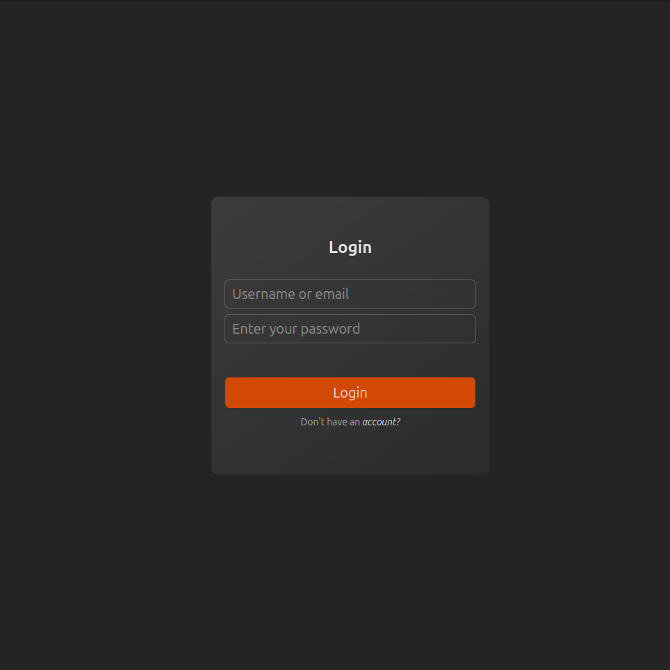
    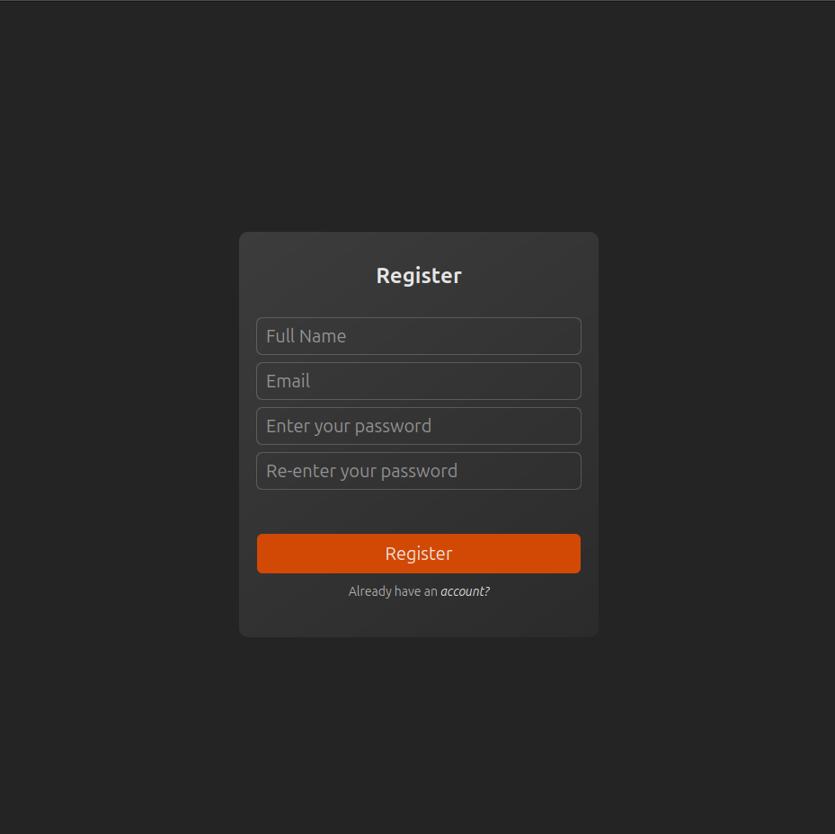
</div>


- **Home**: Home page consists of different basic projects
<div>
    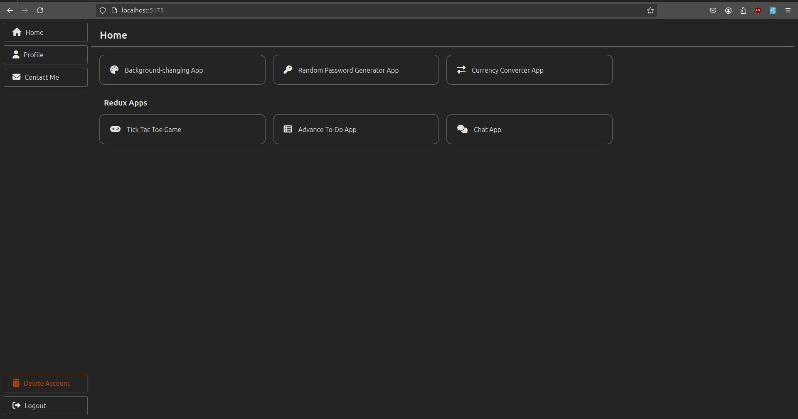
</div>

- **Profile**: A user profile page where users can update their personal details and upload an avatar. This feature enhances user experience by allowing customization of profiles.
<div>
    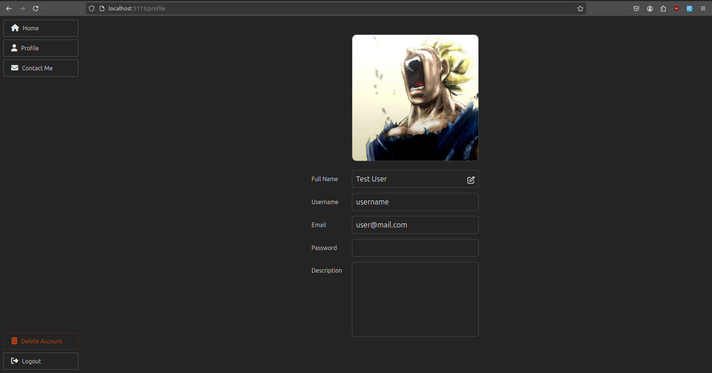
    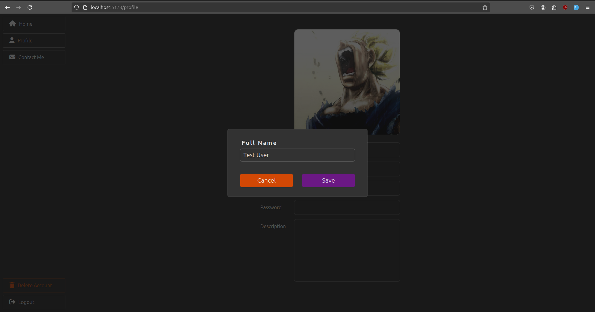
</div>

- **Contact**: A basic contact mail system that allows users to send messages directly through the application. This module facilitates communication and can be used for inquiries or feedback.
<div>
    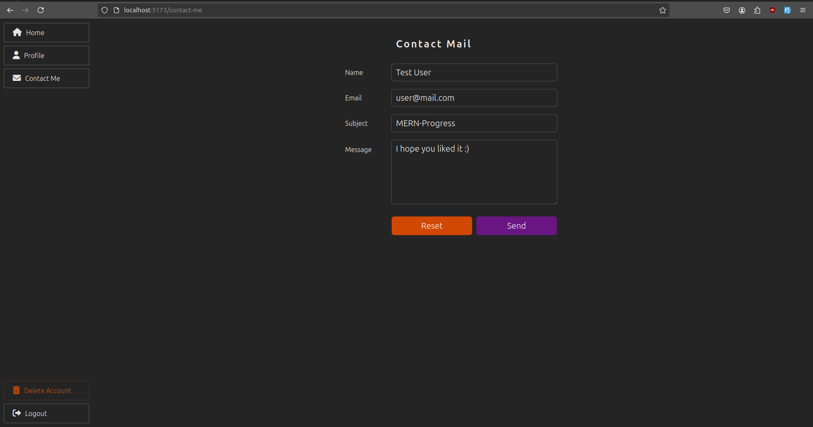
</div>

- **Background Changing, Password Generator and Currency converter App**
<div>
    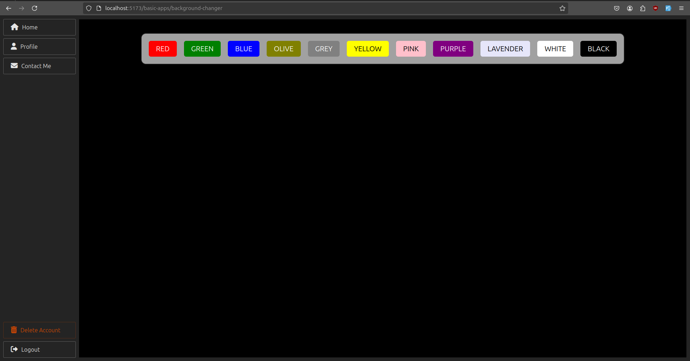
    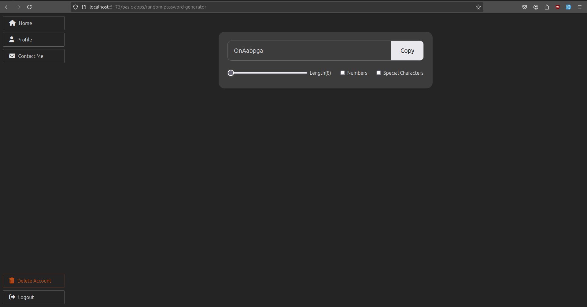
    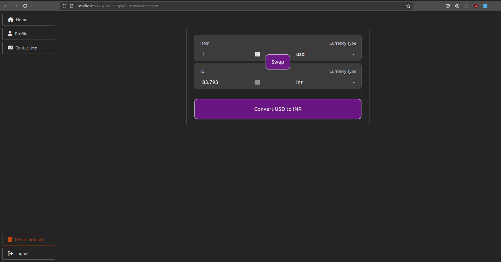
</div>

- **Todo App**: A task management application that supports nested todos, enabling users to organize their tasks using different collections.
<div>
    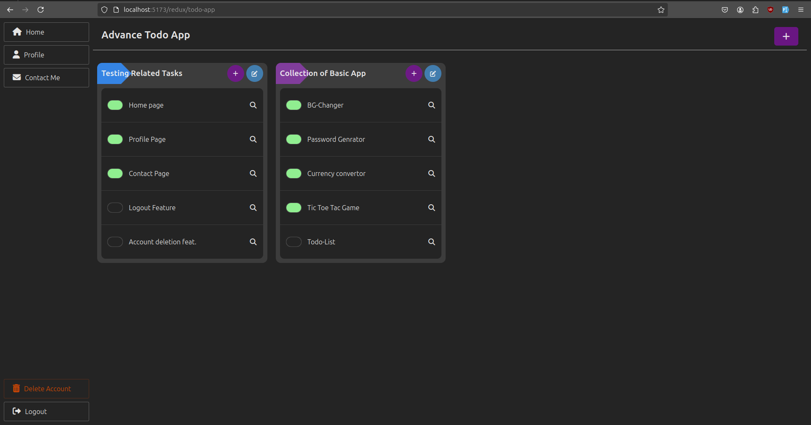
    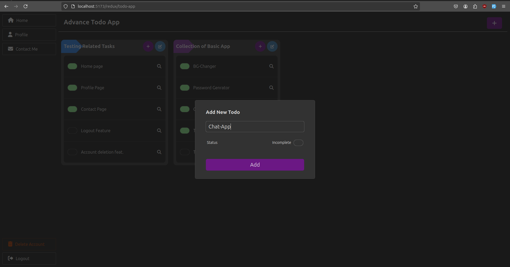
</div>

- **TicTacToe Game**: A simple TicTacToe game where you can play against the computer.
<div>
    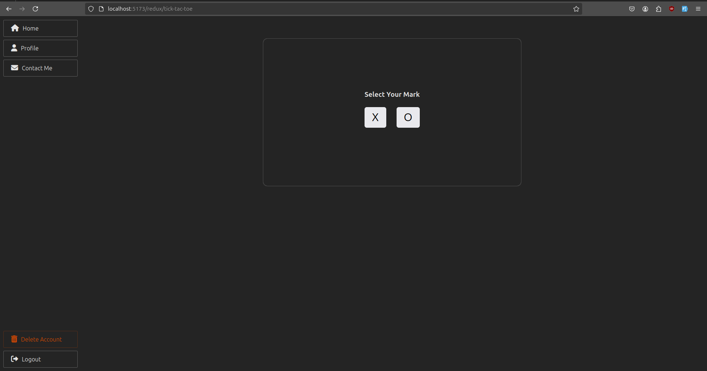
    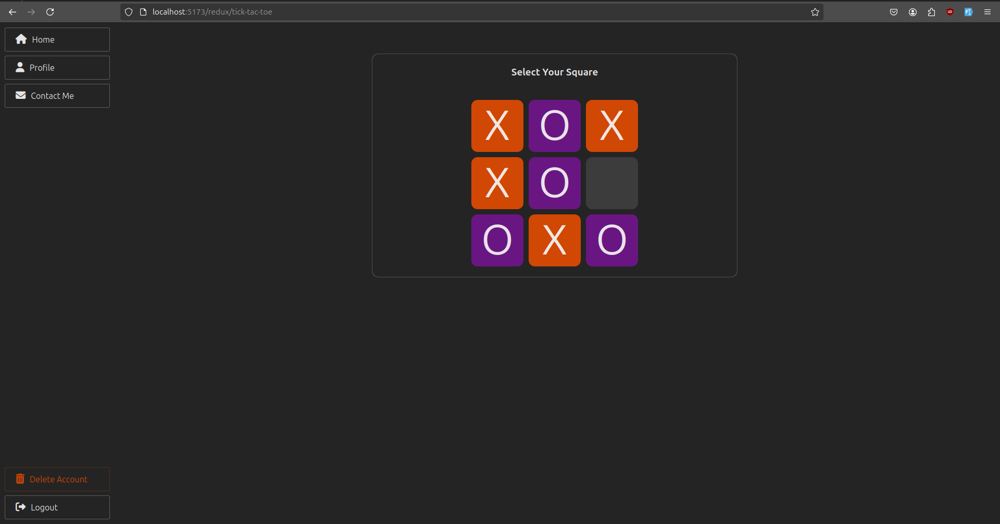
</div>

- **ChatApp**: A real-time chat application implemented with web sockets. Users can send and receive messages instantly, allowing for smooth and dynamic conversations.
<div>
    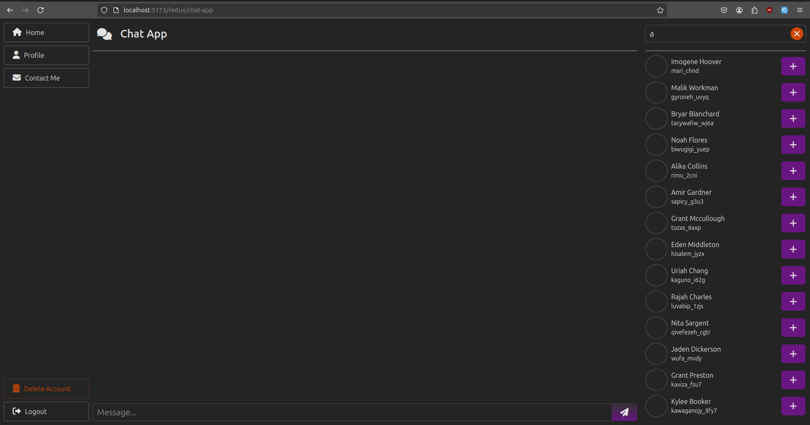
    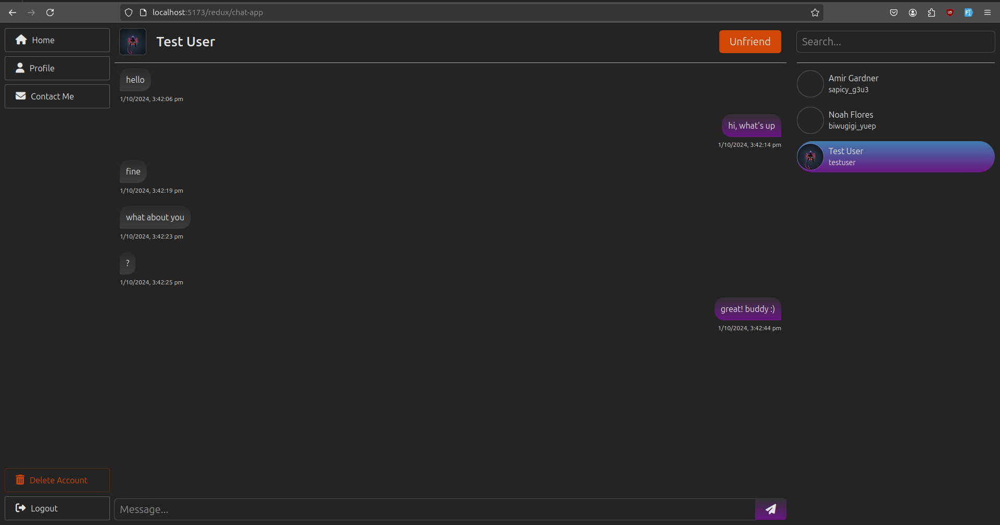
</div>


# Conclusion
Thank you for exploring my MERN progress repository. This collection showcases various projects that highlight my skills and growth as a developer. Each module is designed to demonstrate best of my skills in web development, including efficient state management, and secure authentication.

I welcome any feedback or suggestions, as continuous improvement is a key part of my journey. If you have any questions or would like to collaborate, please feel free to reach out.

Happy coding!
